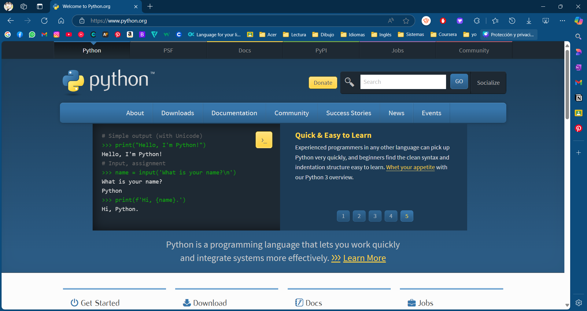
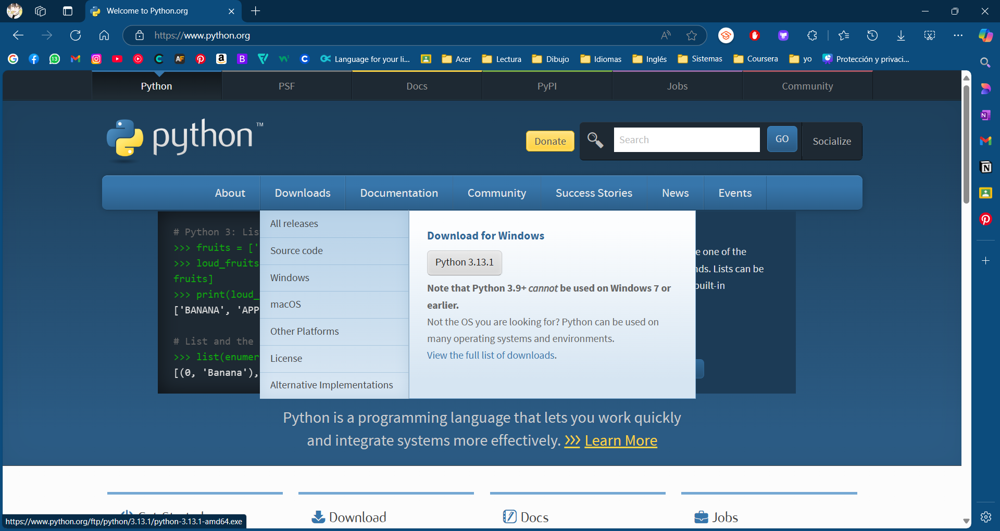
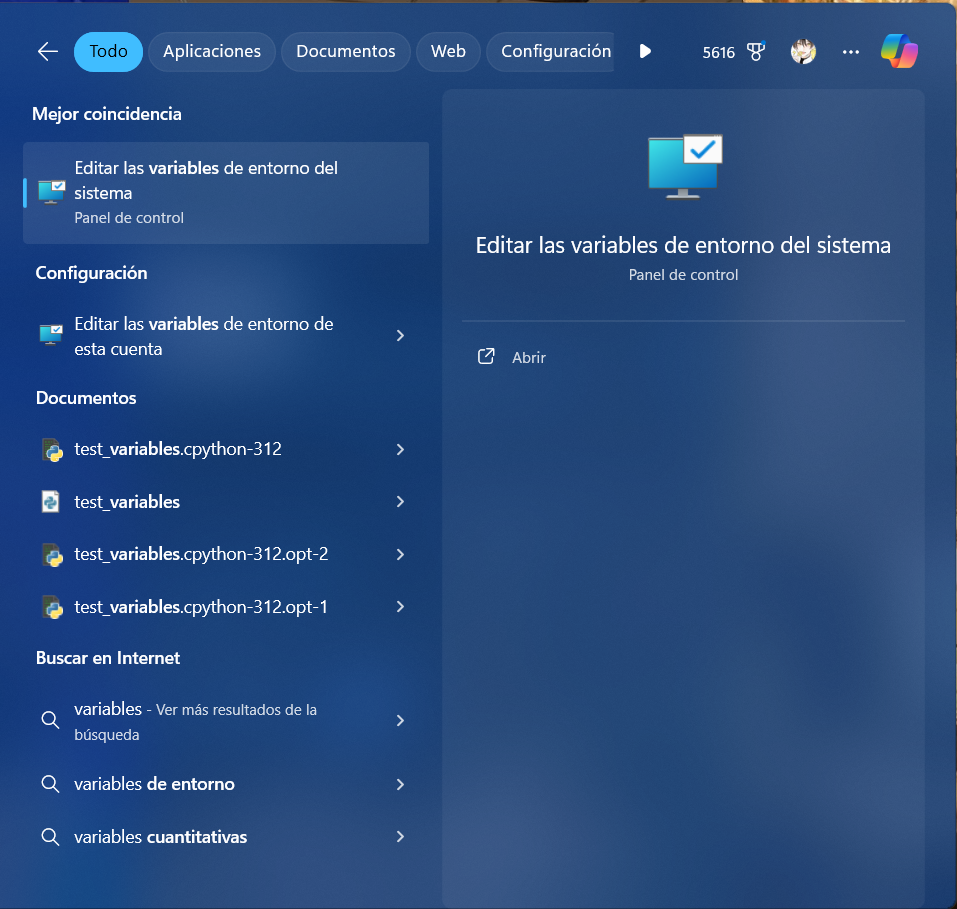
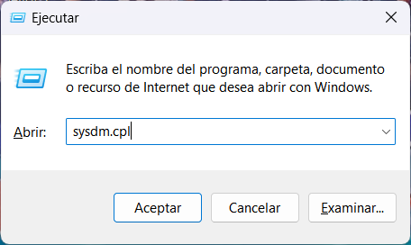

# Instalación de Python y su configuración

Los siguientes pasos nos permitirán instalar adecuadamente Python y configurar las variables de entorno necesarias para desarrollar futuros proyectos con este lenguaje de programación. :snake:
1. Realizamos la buscanda de [Python]() en la página oficial.
    
2. En la pestaña de documentación y selecciona la versión más reciente o haz clic en la opción "Ver la lista completa de descargas". Inicia la descarga del ejecutable cuya versión debe ser compatible con tu sistema operativo.
    
3. Una vez descargado el archivo ejecutable .exe, ejecútalo para iniciar el proceso de instalación.
    
4. En la pantalla inicial, selecciona “Add Python to PATH” y elige “Customize installation” para acceder a opciones avanzadas. Haz clic en continuar.
   
    
6. En la siguiente pantalla, marca los componentes opcionales que desees instalar, como pip, la documentación, etc.
    
7. Configura las opciones avanzadas de instalación, incluyendo el directorio de destino y otras preferencias.
    
8. Haz clic en "Siguiente" para iniciar la instalación. Una vez que los paquetes se instalen, la instalación habrá finalizado.
    
9. Al final se mostrará un mensaje de confirmación. Haz clic en "Close" para finalizar el proceso.

### Configuración de las variables de entorno

1. Para sistema operativo Windows, busca "Editar las variables de entorno del sistema" en el menú de inicio y ábrelo.
    
    > Otra opción de acceder a las "variables de entorno" del sistema desde la ventana de ejecutar oprima la tecla Win + R y escriba **sysdm.cpl**.
    
    
2. En la ventana de Propiedades del Sistema, selecciona “Variables de entorno”.
   
    
3. En la sección de Variables del sistema, encuentra y selecciona la variable Path, luego haz clic en Editar.
    
4. Haz clic en "Nuevo" e ingresa las rutas de los directorios de instalación de Python y Scripts (por ejemplo, C:\Python39 y C:\Python39\Scripts).
   
    
6. Guarda los cambios y cierra todas las ventanas de configuración.
   
Ahora estas list@ para iniciar a desarrollar con Python, good luck! :clap:
